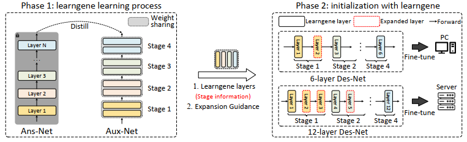

# Exploring Learngene via Stage-wise Weight Sharing for Initializing Variable-sized Models (IJCAI 2024)

[](https://opensource.org/licenses/Apache-2.0) 
<a href="https://pytorch.org/get-started/locally/"></a>

This is the official PyTorch implementation of **IJCAI 2024** paper [Exploring Learngene via Stage-wise Weight Sharing for Initializing Variable-sized Models](https://arxiv.org/abs/).

**Title:** Exploring Learngene via Stage-wise Weight Sharing for Initializing Variable-sized Models

**Authors:** Shiyu Xia, Wenxuan Zhu, Xu Yang and Xin Geng

**Affliations:** Southeast University


## A Gentle Introduction



In the first phase, we build an auxiliary model comprising multiple stages. The layer weights in each stage are shared. Note that the number of layers in each stage and the number of stages are both configurable. Then we train it via distillation. After the learngene learning process, learngene layers containing stage information and expansion guidance are adopted to initialize descendant models of variable depths in the second phase. Finally, these models are fine-tuned normally and deployed to practical scenarios with diverse resource constraints.


## Running SWS

We provide the following shell codes for SWS running. 

### Stage1: Training Aux-Net to obtain learngenes

In the first stage, we train Aux-S/B to obtain learngenes.

#### Training Aux-S

```bash
python3 -u -m torch.distributed.launch --nproc_per_node=4 --master_port 20001 --use_env main.py --model aux_deit_small_patch16_224_L16_33433 --batch-size 128 --epochs 150 --warmup-epochs 5 --data-path path-to-ImageNet-1K --output_dir path-to-output --weight-decay 0.05 --lr 5e-4 --teacher-model levit_384 --teacher-path path-to-teacher --distillation-type soft --distillation-alpha 1.0
```

#### Training Aux-B

```bash
python3 -u -m torch.distributed.launch --nproc_per_node=4 --master_port 20002 --use_env main.py --model aux_deit_base_patch16_224_L16_33433 --batch-size 128 --epochs 100 --warmup-epochs 5 --data-path path-to-ImageNet-1K --output_dir path-to-output --weight-decay 0.05 --lr 5e-4 --teacher-model levit_384 --teacher-path path-to-teacher --distillation-type soft --distillation-alpha 1.0
```


### Stage2: Training Des-Net after initializing with learngenes

In the second stage, we train Des-S/B after initializing them with learngenes.


#### Training 12-layer Des-S

```bash
python3 -u -m torch.distributed.launch --nproc_per_node=4 --master_port 21001 --use_env main.py --model deit_small_patch16_224_L12 --batch-size 128 --epochs 10 --warmup-epochs 0 --weight-decay 0.05 --lr 5e-5 --min-lr 1e-6 --data-path path-to-ImageNet-1K --data-set IMNET --seed 123 --output_dir path-to-output --load-gene /path/to/small_learngene --layers-source '0,0,0,1,1,1,2,2,3,3,4,4'
```

Make sure you update the small learngene path `/path/to/small_learngene`, where you place the small learngene trained from the first stage.

#### Training 12-layer Des-B

```bash
python3 -u -m torch.distributed.launch --nproc_per_node=4 --master_port 22001 --use_env ./main.py --model deit_base_patch16_224_L12 --batch-size 128 --epochs 10 --warmup-epochs 0 --weight-decay 0.05 --lr 1e-5 --min-lr 1e-6 --data-path path-to-ImageNet-1K --data-set IMNET --seed 123 --output_dir path-to-output --load-gene /path/to/base_learngene --layers-source '0,0,0,1,1,1,2,2,3,3,4,4'
```

Make sure you update the base learngene path `/path/to/base_learngene`, where you place the base learngene trained from the first stage.


## Citation

If you use SWS in your research, please consider the following BibTeX to cite it and giving us a star🌟! Thank you!😊

```BibTeX
@inproceedings{xia2024exploring,
  title     = {Exploring Learngene via Stage-wise Weight Sharing for Initializing Variable-sized Models},
  author    = {Xia, Shi-Yu and Zhu, Wenxuan and Yang, Xu and Geng, Xin},
  booktitle = {Proceedings of the Thirty-Third International Joint Conference on Artificial Intelligence, {IJCAI-24}},
  pages     = {5254--5262},
  year      = {2024}
}
```


## Acknowledgement

This implementation is built upon [DeiT](https://github.com/facebookresearch/deit) and [MiniViT](https://github.com/microsoft/Cream/tree/main/MiniViT). We thank the authors for their released code.


## License

This repository is released under the Apache 2.0 license as found in the [LICENSE](./LICENSE.txt) file.

